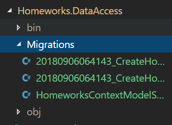
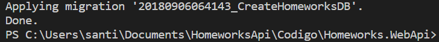

# Clase 3 - Entity Framework Core - Code First

## Paquetes Necesarios

Paquete | Descripción
------------ | -------------
Microsoft.EntityFrameworkCore| EF Core
Microsoft.EntityFrameworkCore.Design| Contiene toda la lógica de design-time para EF Core. Contiene clases que nos serviran para indicarle a EF Tools por ejemplo como crear un contexto.
Microsoft.EntityFrameworkCore.SqlServer| Es el provider para la bd Microsoft SQL Server
Microsoft.EntityFrameworkCore.Tool| Este paquete permite la ejecución de comandos de entityframework (dotnet ef). Este permite hacer más fácil realizar varias tareas de EF Core, como: migraciones, scaffolding, etc
Microsoft.EntityFrameworkCore.InMemory| (Opcional) Es un provider para bd en Memoria, es sobretodo útil para testing.

## DB Context de Referencia

```c#
namespace Homeworks.DataAccess
{
    public class HomeworksContext : DbContext
    {
        public DbSet<Homework> Homeworks {get; set;}
        public DbSet<Exercise> Exercises {get; set;}

        public HomeworksContext(DbContextOptions options) : base(options) { }
    }
}
```

## Microsoft SQL Server

Primero que nada modificaremos nuestra clase ContextFactory para que soporte MSQLS. 
Esta tiene la responsabilidad de crear instancias del db context.

```c#
using Microsoft.EntityFrameworkCore;
using Microsoft.EntityFrameworkCore.Design;

namespace Homeworks.DataAccess
{
    public enum ContextType {
        MEMORY, SQL
    }

    public class ContextFactory : IDesignTimeDbContextFactory<HomeworksContext>
    {
        public HomeworksContext CreateDbContext(string[] args) {
            return GetNewContext();
        }

        public static HomeworksContext GetNewContext(ContextType type = ContextType.SQL) {
            var builder = new DbContextOptionsBuilder<HomeworksContext>();
            DbContextOptions options = null;
            if (type == ContextType.MEMORY) {
                options = GetMemoryConfig(builder);
            } else {
                options = GetSqlConfig(builder);
            }
            return new HomeworksContext(options);
        }

        private static DbContextOptions GetMemoryConfig(DbContextOptionsBuilder builder) {
            builder.UseInMemoryDatabase("HomeworksDB");
            return builder.Options;
        }

        private static DbContextOptions GetSqlConfig(DbContextOptionsBuilder builder) {
            builder.UseSqlServer(@"Server=.\SQLEXPRESS;Database=HomeworksDB;
                Trusted_Connection=True;MultipleActiveResultSets=True;");
            return builder.Options;
        }
    }
}
```

Primer cambio importante que notaran es que ahora ContextFactory está implementando **IDesignTimeDbContextFactory** esta Interfaz le indica a EF Tools como crear los db context, para ello nos pide implementar el siguiente metodo **CreateDbContext**

También agregamos el método GetSqlConfig que se encarga de crear la configuración para la conexión a MSQLS para esto simplemente hacemos builder.UseSqlServer y le pasamos el connection string.

## Creacion de la BD

EF Core a diferencia del viejo EF, no nos creará automáticamente la bd si no se encuentra en MSQLS, entonces para resolver esto tenemos que crear la BD a través de una migración.
Para esto debemos pararnos en el proyecto de Homeworks.WebApi en la consola y lanzar el siguiente comando:

```
 dotnet ef migrations add CreateHomeworksDB -p ..\Homeworks.DataAccess\
```

*-p [proyecto] se coloca el proyecto donde se encuentra el db context en nuestro caso es el DataAccess*

Output: Si vamos al proyecto DataAccess nos debió haber generado una carpeta llamada Migrations con la migración


Después de crear la migración es necesario ejecutarla para eso utilizaremos el siguiente comando:

```
dotnet ef database update -p ..\Homeworks.DataAccess\
```

Output:


## Migraciones

Las migraciones son la manera de mantener el schema de la BD sincronizado con el Dominio, por esto cada vez que se modifica el dominio se deberá crear una migracion.

Commando | Descripción
------------ | -------------
dotnet ef migrations add NOMBRE_DE_LA_MIGRATION| Este comando creará la migración. Crea 3 archivos .cs 1) <timestamp>_<migration name>: Contiene las operaciones Up() y Down() que se aplicaran a la BD para remover o añadir objetos. 2) <timestamp>_<migration name>.Designer: Contiene la metadata que va a ser usada por EF Core. 3) <contextname>ModelSnapshot: Contiene un snapshot del modelo actual. Que será usada para determinar qué cambio cuando se realice la siguiente migración.
dotnet ef database update| Este comando crea la BD en base al context, las clases del dominio y el snapshot de la migración.
dotnet ef migrations remove| Este comando remueve la ultima migración y revierte el snapshot a la migración anterior. Esto solo puede ocurrir si la migración no fue aplicada todavia.
dotnet ef database update NOMBRE_DE_LA_MIGRATION| Este commando lleva la BD al migración del nombre NOMBRE_DE_LA_MIGRATION.
  
## Memoria

Es conveniente para testing usar el provaider InMemory, este nos permite tener una base de datos en memoria. Permitiéndonos no impactar en la BD real.
Para este en particular simplemente se requiere en el builder del context
usar builder.UseInMemoryDatabase y simplemente pasarle como parámetro un string con el nombre de la bd. Ver FactoryContext más arriba.

## Mas Info

* [EF Core Doc](http://www.entityframeworktutorial.net/efcore/entity-framework-core.aspx)
